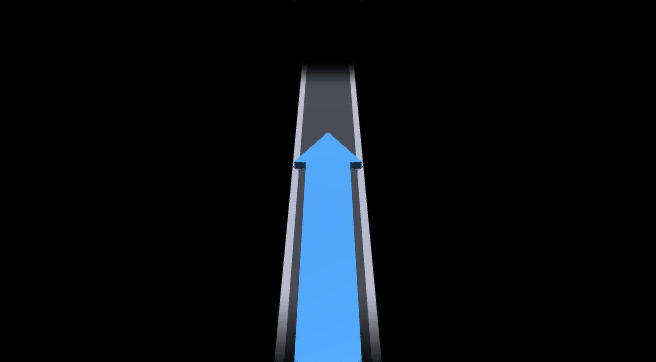
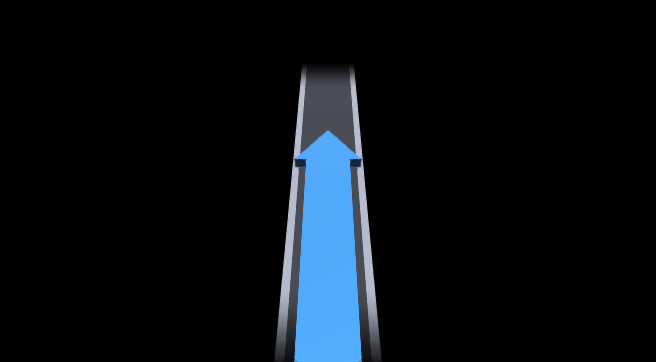

# Complex Navigation Comparison / 复杂导航场景对照

本次测试向同一套真实 renderer 核心输入相同的复杂导航故事，并分别模拟 upstream 原版 Java 状态机与 R3 状态机。测试包含远距离巡航、首次进入接近区、连续 maneuver、短暂无效列表、重规划、再次远离、瞬时 route stop 恢复和最终导航结束。

## 结论

- 两个方案在小窗已经显示后的普通箭头切换、队列处理、bargraph 和 2D/3D 渲染上没有区别；R3 没有修改这部分动画算法。
- 原版把 renderer/context 当作导航期间持续可见的界面：冷启动先显示 `FOLLOW_STREET`，离开接近区仍显示直行符号，无效列表或普通 route stop 不会立即清除上一枚箭头。
- R3 把小窗改成按需显示：只有真实 maneuver 进入接近区才预加载并开启；离开接近区、列表无效和导航结束都会隐藏。
- 因此 R3 的主要收益不是改变箭头画法，而是消除直行占位、陈旧箭头残留和长直路持续占用小窗。

## 关键帧

### 1. 导航开始，距离首个转弯 4200 m

| 原版 | R3 |
| --- | --- |
| 窗口立即打开并显示固定直行占位。 | 窗口隐藏，仪表保持原布局。 |
|  | `gfx/context off - no custom frame` |

### 2. 1450 m 进入接近区，首个真实 maneuver 为右转

| 原版 | R3 |
| --- | --- |
| 从已经显示的直行占位过渡到右转。 | 透明预加载右转，frame-ready 后等待 100 ms，再开窗并启动首箭头动画。 |
|  |  |

静态完成帧的几何基本相同。实际差异发生在出现过程：原版存在“直行占位 -> 真实右转”，R3 是“无窗口 -> 真实右转”。

### 3. 连续左转和并线指令只相隔 280 ms

| 原版 | R3 |
| --- | --- |
|  |  |

两者都由同一个 renderer transition engine 处理：动画进行中时保留最新 pending maneuver，当前过渡结束后再提升它。R3 在这一工况没有新增动画或重复发送 maneuver。

### 4. maneuver 列表短暂清空 900 ms

| 原版 | R3 |
| --- | --- |
| 上一枚并线箭头继续留在窗口。 | 立即关闭 gfx/context，窗口隐藏。 |
|  | `hidden - stale frame is not exposed` |

这是复杂路线中最明显的行为差异。原版等待后续有效 maneuver 覆盖旧图；R3 先隐藏，避免把旧箭头误认为当前指示。

### 5. 重规划后进入环岛

| 原版 | R3 |
| --- | --- |
| 从残留并线箭头正常过渡到环岛。 | 重新预加载当前环岛 maneuver，再执行一次显示序列。 |
|  |  |

### 6. 下一动作变为 5200 m 后、瞬时 route stop 与恢复

原版回到持续显示的直行占位，并在 1200 ms 的 `route_state=0` 期间保持可见。R3 离开接近区即隐藏；route stop 会启动 2500 ms 防抖，1200 ms 内恢复时取消完整关闭，并直接预加载恢复后的真实出口箭头。

| 原版远距离巡航 | 原版恢复后 | R3 恢复后 |
| --- | --- | --- |
|  |  |  |

### 7. 导航结束

| 原版 | R3 |
| --- | --- |
| 普通 `onStop()` 不隐藏，最后的出口箭头可能保持到会话 shutdown 或后续更新。 | 立即隐藏，2500 ms 确认未恢复后完整停止 renderer。 |
|  | `hidden immediately, renderer stopped after debounce` |

## 复现

在本目录的上一级运行：

```powershell
powershell -ExecutionPolicy Bypass -File .\local_test_renderer.ps1 -Scenario Original
powershell -ExecutionPolicy Bypass -File .\local_test_renderer.ps1 -Scenario R3
```

详细事件数据分别保存在 [`original/timeline.csv`](original/timeline.csv) 与 [`r3/timeline.csv`](r3/timeline.csv)。

## 测试边界

本测试实际执行项目的 `render.c`、`maneuver.c`、`route_path.c` 和 R3 renderer 状态机，并依据 upstream/R3 的 Java 源码顺序发送协议命令。它能够比较箭头几何、动画队列、隐藏/重入和状态时序，但不能复现 QNX displaymanager、MOST、context 72/74、真实 iAP2 报文抖动或仪表 LCD 刷新延迟。

